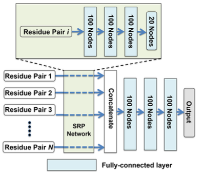

# deepddg-pyotrch

## DeepDDG: Predicting the Stability Change of Protein Point Mutations Using Neural Networks



There is too much in the residue pair feature. Relies on the authors' previous work DenseCPD and some other software not accessible freely. So I only implemented the network.

```python
from model import DeepDDG
deepddg = DeepDDG()
cal_loss = nn.MSELoss()

inp = torch.rand((32, 15, 45))
target = torch.rand((32, 1))


pred = deepddg(inp)
loss = cal_loss(pred, target)
```

## Reference

```bibtex
@article{cao2019deepddg,
 author = {Cao, Huali and Wang, Jingxue and He, Liping and Qi, Yifei and Zhang, John Z.},
 title = {DeepDDG: Predicting the Stability Change of Protein Point Mutations Using Neural Networks},
 journal = {Journal of Chemical Information and Modeling},
 volume = {59},
 number = {4},
 pages = {1508-1514},
 year = {2019},
 doi = {10.1021/acs.jcim.8b00697},note ={PMID: 30759982},
 URL = {https://doi.org/10.1021/acs.jcim.8b00697},
 eprint = {https://doi.org/10.1021/acs.jcim.8b00697}
}
```
